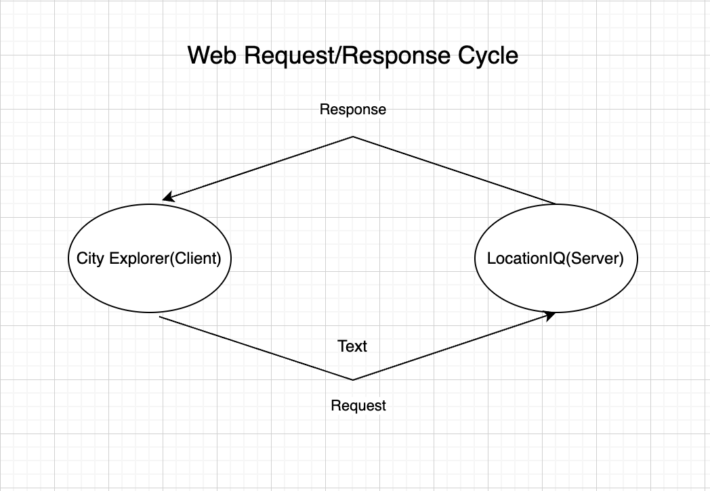

# City Explorer

**Author**: Genevieve DuPuy

## Overview

This application allows users to search for a city and find information regarding the searched location.

## Getting Started
<!-- What are the steps that a user must take in order to build this app on their own machine and get it running? -->

## Architecture

## Change Log

09-18-2023 - Version 1.0.0

- Initialized project using Create React App

## Credit and Collaborations
<!-- Give credit (and a link) to other people or resources that helped you build this application. -->

## Time Estimates

Name of feature: Set up your React repository & API keys
Estimate of time needed to complete: 6 hours
Start time: 10pm
Finish time: 12am
Actual time needed to complete: _____

Name of feature: ________________________________
Estimate of time needed to complete: _____
Start time: _____
Finish time: _____
Actual time needed to complete: _____